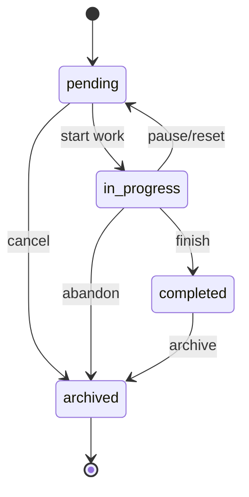

# TodoApp 主要特性/模块详细测试设计与执行文档

**项目名称：** AutoTestDesign 支持下的 TodoApp 测试设计与执行  
**目标应用：** `target-app/` — Flask RESTful TodoApp  
**选定主要特性/模块：** MOD-05 任务状态机模块（Task Status FSM）  
**补充覆盖模块：** 用户注册、用户登录锁定、任务创建字段验证、任务上限、任务访问隔离、任务过滤、CSV 导出  
**测试框架：** PyTest + Flask Test Client + SQLite 内存数据库  
**测试脚本：** `target-app/tests/test_detailed_design_execution.py`  

---

## 1. 测试目的与范围


1. **测试用例设计**：基于 AutoTestDesign 工具的测试设计能力，为选定特性/模块设计测试用例，并说明测试覆盖范围；测试设计同时采用多种黑盒测试技术和白盒测试技术。
2. **测试工具实现**：采用自动化测试框架在目标应用上执行测试，测试脚本与详细测试用例保持可追溯关系。
3. **测试结果分析**：依据自动化测试的实际执行结果进行统计与质量分析。

测试重点选择 **任务状态机模块（MOD-05）**，原因如下：

- 风险分析报告 `docs/risk-analysis-report.md` 将状态机模块列为高风险模块。
- R-22“非法状态转换被接受”风险分为 9，属于 Top 10 高优先级风险。
- R-23“archived 终止态后仍可转换”风险分为 6，同样需要优先验证。
- 该模块天然适合使用 **状态转换测试** 与 **白盒代码路径/分支测试**。

同时，测试范围覆盖状态机相关的前置流程和关键风险点，包括注册、登录锁定、任务字段边界、任务数量上限、授权隔离、过滤和 CSV 导出。

---

## 2. AutoTestDesign 工具使用说明与生成依据

### 2.1 AutoTestDesign 中对应能力

AutoTestDesign 项目位于 `AutoTestDesign/`，其 README 描述了完整测试设计流程：

- `Import`：导入需求。
- `Requirements`：结构化需求、风险分析、生成状态图。
- `Test Cases`：选择测试技术并生成测试用例。
- `Export`：导出测试套件。

测试用例生成逻辑位于：

- `AutoTestDesign/backend/app/services/testcase_service.py`
- `AutoTestDesign/backend/app/services/whitebox_service.py`

其中 `testcase_service.py` 内置了四类测试技术提示词：

| AutoTestDesign 技术项 | 代码中的 technique | 测试设计采用方式 |
|---|---|---|
| 等价类划分 | `equivalence_partitioning` | 用户名字符类、优先级枚举类、状态值有效/无效类 |
| 边界值分析 | `boundary_value_analysis` | 用户名长度、密码长度、标题长度、描述长度、任务数量上限、日期边界 |
| 决策表 | `decision_table` | 登录失败次数与锁定状态组合 |
| 状态转换 | `state_transition` | pending / in_progress / completed / archived 状态迁移 |

`whitebox_service.py` 支持为需求生成 Mermaid 状态图。根据目标应用 README、`models.py` 中的 `ALLOWED_TRANSITIONS` 和风险报告中的 FSM 图，整理出如下状态模型：



### 2.2 需求输入内容

可导入 AutoTestDesign 的核心需求文本如下：

```text
TodoApp 的任务状态初始为 pending，支持 pending、in_progress、completed、archived 四种状态。
允许的状态转换为：pending 到 in_progress，pending 到 archived，in_progress 到 completed，
in_progress 到 pending，in_progress 到 archived，completed 到 archived。
禁止 completed 回退到 pending 或 in_progress；archived 为终止态，不允许再转换到任何状态。
状态变更接口为 PATCH /api/tasks/<id>/status，请求体包含 status 字段。
缺少 status、status 不在枚举范围内、或非法转换时，系统应返回 422；非法转换响应应包含 current_status、requested_status 与 allowed_transitions。
```

### 2.3 AutoTestDesign 生成/整理后的测试主题

结合 AutoTestDesign 的技术分类与项目真实代码，整理得到以下测试主题：

1. **EP 等价类**
   - 状态值有效类：`pending` / `in_progress` / `completed` / `archived`
   - 状态值无效类：`done`、缺少 `status`
   - 优先级有效类：`low` / `medium` / `high`
   - 优先级无效类：`urgent`
2. **BVA 边界值**
   - 用户名长度：3、4、20、21
   - 密码长度：7、32、33
   - 标题长度：0、1、100、101
   - 描述长度：500、501
   - 截止日期：昨天、今天、明天
   - 任务上限：100、101
3. **Decision Table 决策表**
   - 登录失败 1–4 次：401，不锁定
   - 第 5 次失败：423，锁定 15 分钟
   - 锁定期间即使密码正确：仍返回 423
   - 成功登录：失败计数清零
4. **State Transition 状态转换**
   - 覆盖 6 条允许转换
   - 覆盖 6 条代表性禁止转换，包括 `completed -> pending` 与 `archived -> *`
5. **白盒测试**
   - 针对 `target-app/models.py` 中 `ALLOWED_TRANSITIONS` 表进行路径验证。
   - 针对 `target-app/app.py` 中 `/api/tasks/<id>/status` 路由的分支进行测试：缺少字段、无效枚举、非法迁移、合法迁移。
   - 使用测试辅助函数直接设置数据库中任务状态，以触达从 `completed`、`archived` 等非初始状态出发的代码路径。

---

## 3. 被测代码与测试点映射

### 3.1 状态机实现

状态机核心表位于 `target-app/models.py`：

```python
ALLOWED_TRANSITIONS: dict[str, set] = {
    'pending':      {'in_progress', 'archived'},
    'in_progress':  {'completed', 'pending', 'archived'},
    'completed':    {'archived'},
    'archived':     set(),
}
```

状态变更接口位于 `target-app/app.py`：

```python
@app.route('/api/tasks/<int:task_id>/status', methods=['PATCH'])
@login_required
def update_task_status(task_id):
    task = Task.query.filter_by(id=task_id, user_id=g.current_user.id).first()
    if not task:
        return jsonify({'error': 'Task not found'}), 404

    data       = request.get_json(silent=True) or {}
    new_status = data.get('status')

    if not new_status:
        return jsonify({'error': 'status field is required'}), 422
    if new_status not in VALID_STATUSES:
        return jsonify({
            'error': f'Invalid status. Must be one of: {", ".join(VALID_STATUSES)}'
        }), 422

    allowed = ALLOWED_TRANSITIONS.get(task.status, set())
    if new_status not in allowed:
        return jsonify({
            'error': f'Cannot transition from "{task.status}" to "{new_status}"',
            'current_status':     task.status,
            'requested_status':   new_status,
            'allowed_transitions': sorted(allowed),
        }), 422

    task.status     = new_status
    task.updated_at = datetime.utcnow()
    db.session.commit()
    return jsonify({'task': task.to_dict()}), 200
```

### 3.2 主要测试覆盖范围

| 覆盖对象 | 具体覆盖 | 对应测试技术 | 对应脚本函数 |
|---|---|---|---|
| 健康检查 | `/api/health` 基础可用性 | Smoke | `test_health_check_smoke` |
| 注册验证 | 用户名/密码长度与字符类 | EP + BVA | `test_register_validation_ep_bva` |
| 重复注册 | 已存在用户名 | EP | `test_duplicate_registration_is_rejected` |
| 登录锁定 | 1–4 次失败、第 5 次失败、锁定后登录 | 决策表 + BVA | `test_login_lockout_decision_table_on_fifth_failure` |
| 登录计数重置 | 成功登录后失败计数清零 | 状态/路径测试 | `test_successful_login_resets_failed_attempt_counter` |
| 任务创建 | 标题、描述、优先级、日期 | EP + BVA | `test_create_task_validation_ep_bva` |
| 任务数量上限 | 第 100 条与第 101 条 | BVA | `test_create_task_rejects_more_than_100_tasks` |
| 合法状态迁移 | 6 条允许边 | 状态转换 + 白盒表覆盖 | `test_all_allowed_state_transitions` |
| 非法状态迁移 | pending→completed、completed 回退、archived 终止态 | 状态转换 + 分支测试 | `test_forbidden_state_transitions_return_allowed_transitions` |
| 无效状态值 | `done` | EP + 分支测试 | `test_invalid_status_value_is_rejected` |
| 缺少状态字段 | `{}` | EP + 分支测试 | `test_missing_status_field_is_rejected` |
| 授权隔离 | 用户不能访问他人任务 | 授权/安全测试 | `test_task_access_is_isolated_between_users` |
| 过滤 | status / priority 有效过滤与无效状态过滤 | EP | `test_list_tasks_filters_and_rejects_invalid_filters` |
| CSV 导出 | 仅导出当前用户任务；危险公式未转义 | 安全测试 + 数据隔离 | `test_csv_export_contains_current_user_tasks_only_and_exposes_formula_risk` |

---

## 4. 详细测试用例设计

> 说明：下表是基于 AutoTestDesign 的四类生成技术整理出的可执行测试用例集合。实际脚本通过 PyTest 参数化实现，因此一个测试函数可能对应多个测试用例。

### 4.1 EP + BVA：注册输入验证

| 用例 ID | 技术 | 前置条件 | 输入 | 预期结果 | 自动化实现 |
|---|---|---|---|---|---|
| TC-REG-001 | BVA | 无 | username=`abc`，password=`ValidPass123` | 422，用户名过短 | `test_register_validation_ep_bva` |
| TC-REG-002 | BVA | 无 | username=`abcd`，password=`ValidPass123` | 201，注册成功并返回 token | 同上 |
| TC-REG-003 | BVA | 无 | username=20 个 `a` | 201，注册成功 | 同上 |
| TC-REG-004 | BVA | 无 | username=21 个 `a` | 422，用户名过长 | 同上 |
| TC-REG-005 | EP | 无 | username=`bad-name` | 422，非法字符 | 同上 |
| TC-REG-006 | BVA | 无 | password=`short7`，长度 6 | 422，密码过短 | 同上 |
| TC-REG-007 | BVA | 无 | password=32 个 `x` | 201，注册成功 | 同上 |
| TC-REG-008 | BVA | 无 | password=33 个 `x` | 422，密码过长 | 同上 |
| TC-REG-009 | EP | 用户已存在 | 重复注册 `dupeuser` | 409，Username already taken | `test_duplicate_registration_is_rejected` |

### 4.2 决策表：登录失败锁定

决策表如下：

| 条件/动作 | 规则 1 | 规则 2 | 规则 3 | 规则 4 |
|---|---:|---:|---:|---:|
| 用户存在 | Y | Y | Y | Y |
| 密码正确 | N | N | Y | Y |
| 连续失败次数 | 1–4 | 5 | 已锁定 | 失败后成功 |
| 账户锁定中 | N | N | Y | N |
| 返回 401 | Y | N | N | N |
| 返回 423 | N | Y | Y | N |
| 返回 200 | N | N | N | Y |
| 失败计数清零 | N | N | N | Y |

| 用例 ID | 技术 | 步骤 | 预期结果 | 自动化实现 |
|---|---|---|---|---|
| TC-AUTH-001 | 决策表 + BVA | 对同一用户连续输错密码 1–4 次 | 每次返回 401，不锁定 | `test_login_lockout_decision_table_on_fifth_failure` |
| TC-AUTH-002 | 决策表 + BVA | 第 5 次输错密码 | 返回 423，`locked_minutes=15` | 同上 |
| TC-AUTH-003 | 决策表 | 账户锁定后输入正确密码 | 仍返回 423，包含剩余锁定时间 | 同上 |
| TC-AUTH-004 | 状态/路径测试 | 先失败 4 次，再正确登录，再错误登录 1 次 | 正确登录 200；之后一次错误仍为 401，证明计数已清零 | `test_successful_login_resets_failed_attempt_counter` |

### 4.3 EP + BVA：任务创建字段验证

| 用例 ID | 技术 | 输入重点 | 预期结果 | 自动化实现 |
|---|---|---|---|---|
| TC-TASK-001 | BVA | title 长度 0 | 422 | `test_create_task_validation_ep_bva` |
| TC-TASK-002 | BVA | title 长度 1 | 201 | 同上 |
| TC-TASK-003 | BVA | title 长度 100 | 201 | 同上 |
| TC-TASK-004 | BVA | title 长度 101 | 422 | 同上 |
| TC-TASK-005 | BVA | description 长度 500 | 201 | 同上 |
| TC-TASK-006 | BVA | description 长度 501 | 422 | 同上 |
| TC-TASK-007 | EP | priority=`low` | 201 | 同上 |
| TC-TASK-008 | EP | priority=`high` | 201 | 同上 |
| TC-TASK-009 | EP | priority=`urgent` | 422 | 同上 |
| TC-TASK-010 | BVA | due_date=昨天 | 422 | 同上 |
| TC-TASK-011 | BVA | due_date=今天 | 201 | 同上 |
| TC-TASK-012 | BVA | 已有 100 条任务后创建第 101 条 | 422，任务上限错误 | `test_create_task_rejects_more_than_100_tasks` |

### 4.4 状态转换测试：任务状态机

#### 4.4.1 允许转换

| 用例 ID | 当前状态 | 目标状态 | 技术 | 预期结果 | 自动化实现 |
|---|---|---|---|---|---|
| TC-FSM-001 | pending | in_progress | 状态转换 | 200，状态变为 in_progress | `test_all_allowed_state_transitions` |
| TC-FSM-002 | pending | archived | 状态转换 | 200，状态变为 archived | 同上 |
| TC-FSM-003 | in_progress | completed | 状态转换 | 200，状态变为 completed | 同上 |
| TC-FSM-004 | in_progress | pending | 状态转换 | 200，状态变为 pending | 同上 |
| TC-FSM-005 | in_progress | archived | 状态转换 | 200，状态变为 archived | 同上 |
| TC-FSM-006 | completed | archived | 状态转换 | 200，状态变为 archived | 同上 |

#### 4.4.2 禁止转换与错误响应

| 用例 ID | 当前状态 | 目标状态 | 技术 | 预期结果 | 自动化实现 |
|---|---|---|---|---|---|
| TC-FSM-007 | pending | completed | 状态转换 + 分支测试 | 422，返回 allowed_transitions | `test_forbidden_state_transitions_return_allowed_transitions` |
| TC-FSM-008 | completed | pending | 状态转换 + 风险 R-22 | 422，禁止回退 | 同上 |
| TC-FSM-009 | completed | in_progress | 状态转换 + 风险 R-22 | 422，禁止回退 | 同上 |
| TC-FSM-010 | archived | pending | 状态转换 + 风险 R-23 | 422，终止态禁止迁移 | 同上 |
| TC-FSM-011 | archived | in_progress | 状态转换 + 风险 R-23 | 422，终止态禁止迁移 | 同上 |
| TC-FSM-012 | archived | completed | 状态转换 + 风险 R-23 | 422，终止态禁止迁移 | 同上 |
| TC-FSM-013 | pending | done | EP + 分支测试 | 422，状态枚举非法 | `test_invalid_status_value_is_rejected` |
| TC-FSM-014 | pending | 缺少 status 字段 | EP + 分支测试 | 422，提示 `status field is required` | `test_missing_status_field_is_rejected` |

### 4.5 安全与集成补充用例

| 用例 ID | 技术 | 输入/步骤 | 预期结果 | 自动化实现 |
|---|---|---|---|---|
| TC-SEC-001 | 授权测试 | 用户 B 请求用户 A 的任务 ID | 返回 404，不泄露他人任务 | `test_task_access_is_isolated_between_users` |
| TC-FILTER-001 | EP | `status=in_progress&priority=high` | 只返回符合条件任务 | `test_list_tasks_filters_and_rejects_invalid_filters` |
| TC-FILTER-002 | EP | `status=unknown` | 返回 422 | 同上 |
| TC-CSV-001 | 安全测试 | 标题以 `=` 开头并导出 CSV | 当前系统原样导出，暴露 CSV 注入风险 | `test_csv_export_contains_current_user_tasks_only_and_exposes_formula_risk` |
| TC-CSV-002 | 授权/隔离 | 用户 A 导出 CSV，用户 B 也有任务 | CSV 仅包含用户 A 的任务 | 同上 |

---

## 5. 测试工具实现

### 5.1 测试框架选择

选择 **PyTest**，理由如下：

1. TodoApp 是 Python Flask 应用，PyTest 与 Flask Test Client 集成简单。
2. PyTest 支持 `@pytest.mark.parametrize`，适合将 AutoTestDesign 生成的边界值、等价类和状态转换表转化为数据驱动测试。
3. 通过 SQLite 内存数据库可实现快速、隔离、可重复的自动化执行。
4. 测试不依赖启动真实 HTTP 服务，直接调用 Flask app factory，执行速度快，结果稳定。

### 5.2 测试脚本位置

测试脚本位置如下：

```text
target-app/tests/test_detailed_design_execution.py
```

脚本主要结构：

```python
class ExecutionTestConfig(TestConfig):
    SQLALCHEMY_DATABASE_URI = "sqlite:///:memory:"
    TESTING = True
    MAX_TASKS_PER_USER = 100

@pytest.fixture()
def client():
    app = create_app(ExecutionTestConfig)
    with app.app_context():
        db.drop_all()
        db.create_all()
    with app.test_client() as c:
        yield c
    with app.app_context():
        db.session.remove()
        db.drop_all()
```

### 5.3 白盒辅助实现

为了测试从 `completed`、`archived` 等非初始状态出发的路径，脚本中使用了白盒辅助函数直接修改数据库状态：

```python
def set_task_status_directly(app, task_id: int, status: str) -> None:
    """White-box helper: place a task into a specific FSM state."""
    with app.app_context():
        task = db.session.get(Task, task_id)
        task.status = status
        db.session.commit()
```

该函数不是绕过被测接口来判断结果，而是为了构造白盒路径的前置状态。真正的迁移判断仍通过：

```http
PATCH /api/tasks/<id>/status
```

执行。

### 5.4 运行命令

在项目根目录执行：

```bash
python -m pytest target-app/tests/test_detailed_design_execution.py -v --tb=short
```

---

## 6. 测试执行结果

### 6.1 执行环境

测试执行环境如下：

```text
Python 3.13.2
Flask 3.0.3
Flask-SQLAlchemy 3.1.1
    PyJWT 2.8.0
    pytest 9.0.3
Operating System: Windows 11
```

依赖检查命令：

```bash
python --version && python -m pip show Flask Flask-SQLAlchemy PyJWT pytest
```

测试运行命令：

```bash
python -m pytest target-app/tests/test_detailed_design_execution.py -v --tb=short
```

### 6.2 输出摘要

以下为实际运行结果摘要：

```text
============================= test session starts =============================
platform win32 -- Python 3.13.2, pytest-9.0.3, pluggy-1.6.0 -- C:\Python313\python.exe
cachedir: .pytest_cache
rootdir: e:\homework\third\test\AutoTestDesign
plugins: anyio-4.9.0

collecting ... collected 41 items

target-app/tests/test_detailed_design_execution.py::test_health_check_smoke PASSED [  2%]
...
target-app/tests/test_detailed_design_execution.py::test_csv_export_contains_current_user_tasks_only_and_exposes_formula_risk PASSED [100%]

====================== 41 passed, 378 warnings in 5.89s =======================
```

### 6.3 用例结果统计

| 指标 | 数值 |
|---|---:|
| 收集测试项 | 41 |
| 通过 | 41 |
| 失败 | 0 |
| 错误 | 0 |
| 跳过 | 0 |
| 警告 | 378 |
| 执行耗时 | 5.89 秒 |

---

## 7. 测试结果分析

### 7.1 任务状态机模块结论

核心被测模块为 **任务状态机模块**。测试结果显示：

1. **6 条合法状态转换全部通过**
   - `pending -> in_progress`
   - `pending -> archived`
   - `in_progress -> completed`
   - `in_progress -> pending`
   - `in_progress -> archived`
   - `completed -> archived`

2. **代表性非法转换全部被拒绝**
   - `pending -> completed` 返回 422。
   - `completed -> pending` 返回 422。
   - `completed -> in_progress` 返回 422。
   - `archived -> pending/in_progress/completed` 均返回 422。

3. **错误响应内容具备可诊断性**
   - 非法转换响应包含：
     - `current_status`
     - `requested_status`
     - `allowed_transitions`

4. **状态枚举校验有效**
   - `status="done"` 返回 422。
   - 缺少 `status` 字段返回 422。

因此，风险报告中的：

- R-22：非法状态转换被接受
- R-23：archived 终止态后仍可转换
- R-24：无效状态值被接受
- R-25：错误响应缺少 allowed_transitions

在当前测试范围内均未复现为功能失败。

### 7.2 注册与任务输入边界结论

注册与任务创建相关边界测试均通过：

- 用户名 3 个字符被拒绝，4 个字符被接受。
- 用户名 20 个字符被接受，21 个字符被拒绝。
- 非法字符用户名 `bad-name` 被拒绝。
- 密码长度 32 被接受，33 被拒绝。
- 任务标题长度 0 被拒绝，1 和 100 被接受，101 被拒绝。
- 描述长度 500 被接受，501 被拒绝。
- 无效优先级 `urgent` 被拒绝。
- 昨天的截止日期被拒绝，今天的截止日期被接受。
- 第 101 条任务被拒绝，错误信息为 `Task limit reached (100 max)`。

说明服务端输入验证在本测试范围内有效。

### 7.3 登录锁定决策表结论

登录锁定机制测试通过：

- 第 1–4 次错误密码返回 401。
- 第 5 次错误密码返回 423，并返回 `locked_minutes=15`。
- 锁定期间即使输入正确密码也返回 423，并包含 `locked_minutes_remaining`。
- 失败 4 次后成功登录会重置失败计数；再次输错一次只返回 401，不会立即锁定。

因此风险报告中的 R-06、R-07、R-08、R-09 在本测试范围内未表现为失败。

### 7.4 授权隔离与过滤结论

- 用户 B 访问用户 A 的任务 ID 返回 404，未泄露他人任务。
- `status=in_progress&priority=high` 能正确筛选出目标任务。
- 无效过滤状态 `unknown` 返回 422。

说明基本的用户隔离和过滤校验在本测试范围内有效。

### 7.5 CSV 导出风险结论

CSV 导出测试有两个结论：

1. **数据隔离通过**
   - 用户 A 导出 CSV 时，只包含用户 A 自己的任务。
   - 用户 B 的任务不会出现在用户 A 的导出结果中。

2. **CSV 注入风险真实存在**
   - 测试任务标题为：

     ```text
     =HYPERLINK("http://attacker.example","click")
     ```

   - 导出的 CSV 中标题仍以 `=` 开头，未加单引号或其他安全转义。
   - 测试脚本中断言：

     ```python
     assert rows[0]["title"].startswith("=")
     ```

   - 该断言通过，说明风险报告 R-26 描述的 CSV 公式注入风险在当前实现中可以被观察到。

注意：这个测试被设计为“记录当前风险状态”，因此它通过不代表安全问题不存在，而是证明当前系统确实原样导出了危险公式字符串。

### 7.6 警告分析

测试运行产生 378 条 warnings，主要为 `datetime.utcnow()` 的弃用警告，例如：

```text
DeprecationWarning: datetime.datetime.utcnow() is deprecated and scheduled for removal in a future version.
Use timezone-aware objects to represent datetimes in UTC: datetime.datetime.now(datetime.UTC).
```

涉及位置包括：

- `target-app/app.py:60` JWT `exp`
- `target-app/app.py:61` JWT `iat`
- `target-app/app.py:164` health timestamp
- `target-app/app.py:203` 锁定剩余时间计算
- `target-app/app.py:212` 锁定截止时间设置
- `target-app/app.py:389` 任务更新时间
- `target-app/models.py:76` 用户锁定判断

这些警告未导致测试失败，但建议后续改为 timezone-aware 写法，例如：

```python
from datetime import datetime, UTC

datetime.now(UTC)
```

---

## 8. 覆盖范围说明

### 8.1 黑盒技术覆盖

| 技术 | 覆盖内容 | 覆盖充分性说明 |
|---|---|---|
| 等价类划分 EP | 有效/无效用户名字符、优先级枚举、状态枚举、过滤条件、重复用户名 | 覆盖主要输入域的有效类和无效类 |
| 边界值分析 BVA | 用户名 3/4/20/21，密码 32/33，标题 0/1/100/101，描述 500/501，日期昨天/今天，任务数 100/101 | 覆盖高风险边界点和典型 off-by-one 缺陷 |
| 决策表 | 登录失败次数 × 锁定状态 × 密码正确性 | 覆盖锁定机制核心规则 |
| 状态转换测试 | 6 条合法迁移、6 条代表性非法迁移、终止态 archived | 覆盖 FSM 主路径和关键禁止边 |
| 安全测试 | 用户隔离、CSV 公式注入探针 | 覆盖授权与导出安全风险 |

### 8.2 白盒技术覆盖

| 技术 | 覆盖点 | 说明 |
|---|---|---|
| 分支测试 | `/api/tasks/<id>/status` 中 task not found、缺少 status、无效 status、非法转换、合法转换分支中的后四类 | 本脚本重点覆盖状态接口核心分支；task not found 通过授权隔离用例间接覆盖 404 路径 |
| 条件测试 | `new_status not in VALID_STATUSES`、`new_status not in allowed`、`task_count >= max_tasks` | 覆盖 True/False 两侧 |
| 路径测试 | 注册→登录/获取 token→创建任务→状态变更→查询/导出 | 覆盖典型业务链路 |
| 数据流测试 | token 从注册/登录响应进入 Authorization header；task_id 从创建响应进入后续 PATCH/GET；状态字段从数据库进入转换表判断 | 验证关键数据在接口间传递正确 |
| 表驱动白盒测试 | `ALLOWED_TRANSITIONS` 的 4 个 key 与 6 条边 | 直接根据实现表构造当前状态，验证允许边与禁止边 |

### 8.3 未覆盖范围与原因

| 未覆盖项 | 原因 | 后续建议 |
|---|---|---|
| JWT 过期 token | 需要构造过期 JWT 或控制时间，当前测试范围聚焦状态机与输入边界 | 增加 PyJWT 构造过期 token 的测试 |
| DELETE / PUT 完整 CRUD | 当前测试范围主要围绕状态机和创建字段验证 | 增加更新字段边界和删除后访问测试 |
| 并发创建第 101 条任务 | Flask Test Client 单线程执行，未模拟并发竞态 | 使用多线程或集成测试模拟并发 |
| CSV 注入修复验证 | 当前系统尚未修复，本报告记录风险现状 | 修复后将断言改为危险字符被转义 |
| 性能/压力测试 | 当前测试范围不包含性能与压力测试 | 后续可使用 Locust/JMeter |

---

## 9. 缺陷与改进建议

### 9.1 已确认风险：CSV 公式注入

**现象：** 以 `=` 开头的任务标题导出 CSV 后仍以 `=` 开头。  
**影响：** 用户用 Excel/LibreOffice 打开 CSV 时可能触发公式执行。  
**风险 ID：** R-26。  
**建议修复：** 在 CSV 导出前对以 `=`, `+`, `-`, `@`, `\t`, `\r` 开头的字符串加前缀单引号或进行安全转义。

示例修复思路：

```python
def sanitize_csv_cell(value):
    if isinstance(value, str) and value.startswith(("=", "+", "-", "@", "\t", "\r")):
        return "'" + value
    return value
```

### 9.2 技术债：UTC 时间写法弃用

**现象：** Python 3.13 运行时出现大量 `datetime.utcnow()` 弃用警告。  
**影响：** 当前不影响测试通过，但未来 Python 版本可能移除或行为变化。  
**建议修复：** 使用 `datetime.now(UTC)`，并统一处理 timezone-aware datetime。

---

## 10. 结论

本轮测试围绕 TodoApp 的任务状态机模块展开，并结合认证、输入校验、授权隔离、过滤和 CSV 导出等相关风险点进行了补充验证。测试设计采用 AutoTestDesign 支持的等价类划分、边界值分析、决策表和状态转换测试方法，同时结合被测代码中的状态迁移表、接口分支和关键数据流设计白盒测试场景。

综合测试设计与实际执行结果，可以得出以下结论：

1. **任务状态机核心规则符合预期**
   - `pending`、`in_progress`、`completed`、`archived` 四种状态之间的 6 条合法迁移均能正确执行。
   - `completed` 回退到未完成状态、`archived` 终止态继续迁移等高风险非法路径均被拒绝。
   - 非法迁移响应中包含当前状态、目标状态和允许迁移列表，具备较好的错误诊断能力。

2. **主要输入边界和枚举校验有效**
   - 用户名、密码、任务标题、任务描述、截止日期和任务数量上限等边界条件均按预期处理。
   - 无效优先级、无效任务状态和无效过滤条件均返回错误响应，未观察到明显的输入绕过问题。

3. **认证与授权相关规则基本有效**
   - 登录失败锁定机制符合决策表预期：连续失败达到阈值后账户被锁定，锁定期间即使密码正确也不能登录。
   - 成功登录后失败计数能够重置。
   - 用户访问他人任务时返回 404，未在响应中直接暴露他人任务数据。

4. **测试中发现的主要风险点**
   - CSV 导出存在公式注入风险：以 `=` 开头的任务标题会被原样写入 CSV 文件。该风险在自动化测试中被真实观察到，建议在导出前对 `=`, `+`, `-`, `@`, `\t`, `\r` 等危险前缀进行转义。
   - 运行过程中出现大量 `datetime.utcnow()` 弃用警告。虽然当前不影响测试通过，但从长期维护角度看，应统一迁移到 timezone-aware 的时间处理方式，例如 `datetime.now(UTC)`。

5. **总体质量评价**
   - 在当前测试范围内，任务状态机、输入校验、登录锁定和用户隔离等核心功能表现稳定。
   - 当前系统仍存在安全与可维护性方面的改进空间，尤其是 CSV 导出安全处理和 UTC 时间写法更新。
   - 后续测试应继续补充 JWT 过期、完整 CRUD 更新/删除、并发创建任务上限、CSV 注入修复回归和性能压力场景，以提高测试覆盖完整性。
