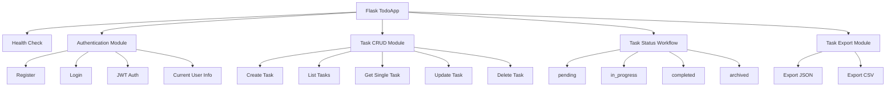
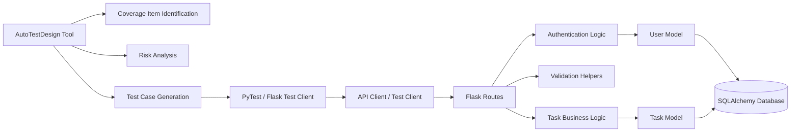
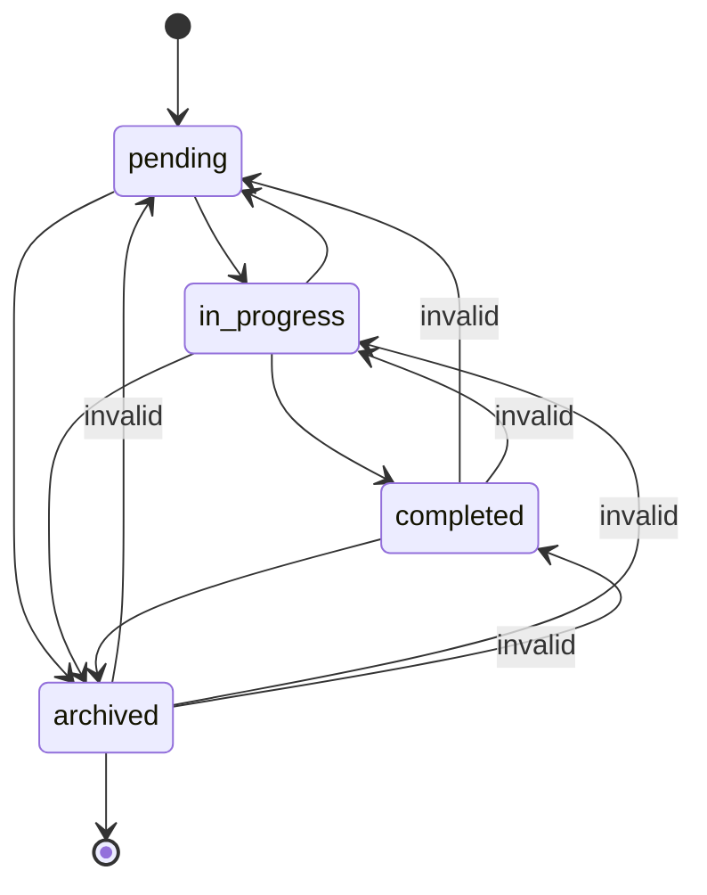
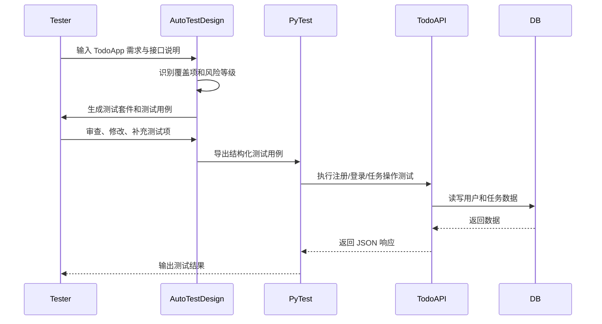

# 测试计划书

## 1. 项目范围

### 1.1 测试背景

本项目的测试对象为Flask TodoApp。Flask TodoApp 是一个基于 Flask 的 REST API 待办事项管理系统，主要提供用户注册、用户登录、JWT 认证、任务创建、任务查询、任务更新、任务删除、任务状态转换以及任务导出等功能。本测试活动使用 AutoTestDesign 工具辅助完成需求解析、风险分析、覆盖项识别、测试策略选择和测试用例生成，并结合 PyTest、Flask Test Client 等测试框架执行自动化测试。

---

### 1.2 测试总体目标

测试计划的总体目标如下：

1. 验证 Flask TodoApp 的核心功能是否符合需求，包括用户认证、任务管理、状态流转和任务导出。
2. 验证输入校验规则是否正确执行，包括用户名、密码、任务标题、任务描述、优先级、截止日期和最大任务数量限制。
3. 验证认证与授权机制是否可靠，未认证用户不得访问受保护接口，非法或过期 token 应被拒绝。
4. 验证任务状态转换是否符合预定义有限状态机规则。
5. 验证系统对异常输入、非法请求、边界数据和错误操作的处理能力。
6. 通过 AutoTestDesign 工具生成风险驱动的测试套件，并由人工测试设计者进行交互式审查、修改和补充。
7. 比较使用 AutoTestDesign 辅助测试与纯手工测试在成本、覆盖率和可追溯性方面的差异。

---

### 1.3 测试范围

#### 范围内测试内容

| 编号   | 范围内测试内容 | 说明                                                           |
| ---- | ------- | ------------------------------------------------------------ |
| S-01 | 健康检查接口  | 验证 `/api/health` 是否返回正常服务状态                                  |
| S-02 | 用户注册    | 验证用户名、密码边界与非法输入处理                                            |
| S-03 | 用户登录    | 验证登录成功、登录失败、账号锁定机制                                           |
| S-04 | JWT 认证  | 验证未认证、非法 token、过期 token、有效 token 等情况                         |
| S-05 | 任务创建    | 验证标题、描述、优先级、截止日期、最大任务数限制                                     |
| S-06 | 任务查询    | 验证任务列表查询与单个任务查询                                              |
| S-07 | 任务更新    | 验证任务字段更新、非法字段和边界值更新                                          |
| S-08 | 任务删除    | 验证任务删除、重复删除和越权删除                                             |
| S-09 | 任务状态转换  | 验证 `pending`、`in_progress`、`completed`、`archived` 之间的合法和非法转换 |
| S-10 | 任务导出    | 验证 JSON 和 CSV 格式导出                                           |
| S-11 | 非功能测试   | 包括基础性能、安全性、可用性和可维护性测试                                        |

#### 范围外测试内容

| 编号   | 范围外测试内容         | 原因                           |
| ---- | --------------- | ---------------------------- |
| O-01 | 大规模生产环境压力测试     | 本项目为课程项目，测试资源有限              |
| O-02 | 多服务器部署与分布式一致性测试 | 当前应用为单体 Flask 应用             |
| O-03 | 移动端原生 App 测试    | 目标应用是 Flask REST API，不是移动端应用 |
| O-04 | 第三方 OAuth 登录测试  | 当前应用未实现第三方登录                 |
| O-05 | 完整渗透测试          | 本计划只覆盖基础安全测试，如认证、非法访问和输入注入风险 |

---

## 2. 测试项

### 2.1 目标应用功能概述

Flask TodoApp 提供如下 REST API：健康检查、用户注册、用户登录、当前用户信息查询、任务列表查询、任务创建、单个任务查询、任务更新、任务删除、任务状态转换和任务导出。

这些功能可以划分为五个主要测试模块：

---

### 2.2 功能性测试项

| 测试项编号 | 功能模块   | 接口/对象                                   | 主要测试内容                    | 风险等级 |
| ----- | ------ | --------------------------------------- | ------------------------- | ---- |
| TI-01 | 健康检查   | `GET /api/health`                       | 服务是否正常返回 `status: ok`     | 低    |
| TI-02 | 用户注册   | `POST /api/auth/register`               | 用户名、密码合法性、重复用户名           | 高    |
| TI-03 | 用户登录   | `POST /api/auth/login`                  | 正确登录、错误密码、账号锁定            | 高    |
| TI-04 | 当前用户信息 | `GET /api/auth/me`                      | 有效 token、无 token、非法 token | 高    |
| TI-05 | 任务创建   | `POST /api/tasks`                       | 标题、描述、优先级、截止日期、最大任务数      | 高    |
| TI-06 | 任务列表查询 | `GET /api/tasks`                        | 空列表、单条任务、多条任务、用户隔离        | 中    |
| TI-07 | 单个任务查询 | `GET /api/tasks/<id>`                   | 存在任务、不存在任务、越权访问           | 中    |
| TI-08 | 任务更新   | `PUT /api/tasks/<id>`                   | 合法更新、非法字段、边界值更新           | 高    |
| TI-09 | 任务删除   | `DELETE /api/tasks/<id>`                | 删除成功、重复删除、不存在任务、越权删除      | 中高   |
| TI-10 | 状态转换   | `PATCH /api/tasks/<id>/status`          | 合法状态转换、非法状态转换、终态限制        | 高    |
| TI-11 | 任务导出   | `GET /api/tasks/export?format=json/csv` | JSON 导出、CSV 导出、非法格式       | 中    |

---

### 2.3 输入校验测试项

代码中的输入校验规则是等价类划分和边界值分析的依据。用户名长度为 4–20 个字符，只允许字母、数字和下划线；密码长度为 8–32 个字符；任务标题长度为 1–100 个字符；任务描述长度为 0–500 个字符；优先级只能是 `low`、`medium`、`high`；截止日期格式应为 `YYYY-MM-DD`，创建任务时不能是过去日期；每个用户最多 100 个任务；连续登录失败 5 次后账号锁定 15 分钟。

| 字段           | 有效范围/规则                 | 典型有效值             | 典型无效值               | 适用测试技术      |
| ------------ | ----------------------- | ----------------- | ------------------- | ----------- |
| username     | 4–20 字符，字母/数字/下划线       | `user_01`         | `abc`、21 字符、`user!` | 等价类划分、边界值分析 |
| password     | 8–32 字符                 | `password123`     | 7 字符、33 字符、空值       | 等价类划分、边界值分析 |
| title        | 1–100 字符                | `Finish homework` | 空标题、101 字符          | 等价类划分、边界值分析 |
| description  | 0–500 字符                | `This is a task`  | 501 字符              | 边界值分析       |
| priority     | `low`、`medium`、`high`   | `medium`          | `urgent`、空值         | 等价类划分       |
| due_date     | `YYYY-MM-DD`，创建时不能为过去日期 | 明天日期              | 昨天日期、`2026/01/01`   | 等价类划分、边界值分析 |
| task count   | 每用户最多 100 个任务           | 99、100            | 101                 | 边界值分析       |
| failed login | 最多失败 5 次，锁定 15 分钟       | 0–4 次失败           | 第 5 次后继续登录          | 边界值分析、状态测试  |

---

### 2.4 非功能性测试项

非功能需求包括性能、可用性、安全性、可维护性与技术等方面。 本项目非功能性测试项如下：

| 非功能类型 | 测试目标                | 测试方法                    | 通过标准               |
| ----- | ------------------- | ----------------------- | ------------------ |
| 性能    | 验证常用 API 在轻量负载下响应及时 | 使用 PyTest 记录接口响应时间      | 主要接口响应时间小于 2 秒     |
| 可用性   | 验证 API 错误信息是否清晰     | 检查错误响应 JSON 内容          | 错误信息可读且状态码合理       |
| 安全性   | 验证认证机制和输入处理         | 测试未授权访问、非法 token、特殊字符输入 | 受保护接口必须拒绝非法访问      |
| 可靠性   | 验证异常输入下系统不崩溃        | 输入空值、非法 JSON、非法状态       | 返回 4xx 错误而非 5xx 崩溃 |
| 可维护性  | 验证测试资产是否结构化         | 检查测试用例、测试数据、脚本组织        | 测试脚本可重复执行、易于扩展     |

---

### 2.5 系统架构与主要组件

Flask TodoApp 采用典型的 Flask REST API 架构。应用通过 `create_app` 工厂函数创建 Flask 实例，初始化配置与数据库，并通过 SQLAlchemy 管理 `User` 和 `Task` 两类核心数据模型。`User` 模型包含用户名、密码哈希、登录失败次数、锁定时间和任务关系；`Task` 模型包含标题、描述、优先级、状态、截止日期、创建时间、更新时间和所属用户。  

主要组件说明如下：

| 组件                         | 说明                    | 测试关注点               |
| -------------------------- | --------------------- | ------------------- |
| Flask Routes               | 接收 HTTP 请求并返回 JSON 响应 | 路由可达性、状态码、响应结构      |
| Authentication Logic       | 处理注册、登录、JWT 认证        | token 有效性、非法访问、账号锁定 |
| Validation Helpers         | 校验用户名、密码、任务字段         | 边界值、非法输入、错误提示       |
| User Model                 | 保存用户信息与登录状态           | 唯一用户名、密码哈希、锁定状态     |
| Task Model                 | 保存任务信息                | 字段约束、状态、用户隔离        |
| SQLAlchemy Database        | 数据持久化                 | 数据一致性、查询与删除正确性      |
| AutoTestDesign             | 辅助生成风险分析和测试用例         | 覆盖项完整性、测试策略合理性      |
| PyTest / Flask Test Client | 自动化执行测试               | 可重复执行、快速反馈          |

---

## 3. 高级测试套件设计

### 3.1 风险驱动测试策略

AutoTestDesign 首先导入 Flask TodoApp 的需求和接口说明，对需求进行结构化解析，识别输入字段、数据范围、条件和预期动作。随后，工具根据功能失败影响、发生概率、输入复杂度、安全敏感性和业务重要性生成风险评分与测试优先级。最后，测试设计者对工具生成的覆盖项、测试策略和测试用例进行交互式审查、修订和补充。
  

风险优先级划分如下：

| 风险等级 | 判定标准                      | 测试策略                 |
| ---- | ------------------------- | -------------------- |
| 高    | 涉及认证、数据正确性、状态转换、安全或核心业务流程 | 优先测试，覆盖正常、异常、边界和组合场景 |
| 中    | 涉及辅助功能、查询、导出或用户体验         | 覆盖主要路径和关键异常路径        |
| 低    | 影响较小或实现简单的功能              | 进行冒烟测试和基本回归测试        |

---

### 3.2 测试套件总览

| 测试套件编号 | 测试套件名称      | 覆盖测试项       | 风险等级 | 测试技术            | 选择理由                         |
| ------ | ----------- | ----------- | ---- | --------------- | ---------------------------- |
| TS-01  | 健康检查测试套件    | TI-01       | 低    | 冒烟测试            | 健康检查用于快速判断服务是否可用             |
| TS-02  | 用户注册测试套件    | TI-02       | 高    | 等价类划分、边界值分析     | 用户名和密码有明确长度与字符规则             |
| TS-03  | 用户登录与锁定测试套件 | TI-03       | 高    | 决策表、边界值分析、状态测试  | 登录结果受用户名、密码、失败次数、锁定状态共同影响    |
| TS-04  | JWT 认证测试套件  | TI-04       | 高    | 决策表、错误推测、安全测试   | 受保护接口必须正确处理缺失、非法、过期和有效 token |
| TS-05  | 任务创建测试套件    | TI-05       | 高    | 等价类划分、边界值分析     | 标题、描述、优先级、截止日期、任务数量均存在输入约束   |
| TS-06  | 任务查询测试套件    | TI-06、TI-07 | 中    | 等价类划分、场景测试      | 覆盖空列表、单任务、多任务、不存在任务、用户隔离     |
| TS-07  | 任务更新测试套件    | TI-08       | 高    | 决策表、等价类划分、边界值分析 | 更新字段组合多，存在合法/非法字段与边界值        |
| TS-08  | 任务删除测试套件    | TI-09       | 中高   | 错误推测、场景测试       | 删除操作不可逆，需要覆盖重复删除和不存在资源       |
| TS-09  | 任务状态机测试套件    | TI-10       | 高    | 状态转换测试、决策表、白盒分支/路径      | 包含明确的有限状态机规则和高风险非法迁移路径     |
| TS-10  | 任务导出测试套件    | TI-11       | 中    | 等价类划分、接口测试      | 导出格式只有 JSON/CSV，非法格式应被拒绝     |
| TS-11  | 非功能测试套件     | NFR         | 中高   | 性能测试、安全测试、可靠性测试 | 覆盖响应时间、未授权访问、异常输入和系统稳定性      |

---

### 3.3 测试技术与覆盖项映射

| 测试技术   | 应用位置                     | 代表覆盖项                                             |
| ------ | ------------------------ | ------------------------------------------------- |
| 等价类划分  | 注册、任务创建、任务更新、导出格式        | 有效用户名/无效用户名，有效优先级/无效优先级                           |
| 边界值分析  | 用户名、密码、标题、描述、任务数量、登录失败次数 | 3/4/20/21 字符，99/100/101 个任务                       |
| 决策表测试  | 登录、认证、任务更新、状态转换          | token 是否存在、token 是否有效、用户是否存在                      |
| 状态转换测试 | 任务状态流转、账号锁定              | `pending → in_progress`，`archived → completed` 非法 |
| 场景测试   | 端到端任务管理流程                | 注册 → 登录 → 创建任务 → 更新状态 → 导出 → 删除                   |
| 错误推测   | 删除、非法 ID、非法 JSON、越权访问    | 删除不存在任务、重复删除、访问他人任务                               |
| 安全测试   | JWT、输入字段、越权访问            | 无 token 访问、非法 token、特殊字符输入                        |
| 性能测试   | 高频 API、任务列表、导出           | 接口响应时间、100 个任务导出时间                                |

---

### 3.4 任务状态转换测试设计

`models.py` 中定义了任务状态：`pending`、`in_progress`、`completed`、`archived`，并给出了允许的状态转换规则。`pending` 可以转换为 `in_progress` 或 `archived`；`in_progress` 可以转换为 `completed`、`pending` 或 `archived`；`completed` 只能转换为 `archived`；`archived` 是终止状态，不能再转换到任何状态。

状态转换测试覆盖目标：

| 当前状态        | 目标状态        | 预期结果 | 测试类型   |
| ----------- | ----------- | ---- | ------ |
| pending     | in_progress | 成功   | 合法转换   |
| pending     | archived    | 成功   | 合法转换   |
| in_progress | completed   | 成功   | 合法转换   |
| in_progress | pending     | 成功   | 合法转换   |
| in_progress | archived    | 成功   | 合法转换   |
| completed   | archived    | 成功   | 合法转换   |
| completed   | pending     | 失败   | 非法转换   |
| completed   | in_progress | 失败   | 非法转换   |
| archived    | pending     | 失败   | 终态非法转换 |
| archived    | in_progress | 失败   | 终态非法转换 |
| archived    | completed   | 失败   | 终态非法转换 |

---

### 3.5 端到端场景测试设计

端到端主流程如下：

1. 调用 `/api/health` 验证服务正常。
2. 注册新用户。
3. 使用新用户登录并获取 JWT token。
4. 使用 token 创建任务。
5. 查询任务列表，确认任务创建成功。
6. 更新任务标题、描述、优先级或截止日期。
7. 执行任务状态转换。
8. 导出任务为 JSON 或 CSV。
9. 删除任务。
10. 再次查询任务，确认任务已删除。

---

## 4. 进度安排与检查清单

### 4.1 测试阶段安排

| 阶段      | 主要活动                               | 测试级别      | 目标            | 输出物         |
| ------- | ---------------------------------- | --------- | ------------- | ----------- |
| Phase 1 | 阅读 TodoApp 代码与接口说明，确认测试范围          | 需求审查      | 明确测试对象和边界     | 测试范围说明      |
| Phase 2 | 使用 AutoTestDesign 导入需求并生成风险分析      | 静态测试/风险分析 | 识别高风险功能       | 风险评分表       |
| Phase 3 | 识别覆盖项并生成高级测试套件                     | 测试设计      | 建立测试策略        | 测试套件设计表     |
| Phase 4 | 编写 PyTest 和 Flask Test Client 测试脚本 | 单元/接口测试   | 自动执行核心 API 测试 | 自动化测试脚本     |
| Phase 5 | 执行测试并记录结果                          | 系统测试      | 验证功能正确性       | 测试执行结果      |
| Phase 6 | 分析失败测试并补充测试用例                      | 回归测试      | 改进覆盖率和有效性     | 缺陷分析与改进记录   |
| Phase 7 | 整理测试计划、测试设计和演示材料                   | 文档整理      | 形成最终交付物       | 报告与 PPT |

---

### 4.2 测试级别与目标

| 测试级别  | 测试对象               | 测试目标             | 工具/框架                      |
| ----- | ------------------ | ---------------- | -------------------------- |
| 需求级测试 | 需求文本、接口说明、业务规则     | 确认需求可测试、规则清晰     | AutoTestDesign             |
| 单元测试  | 校验函数、模型方法、状态规则     | 验证局部逻辑正确性        | PyTest                     |
| 接口测试  | REST API endpoints | 验证状态码、响应体、数据库效果  | PyTest + Flask Test Client |
| 系统测试  | 完整 TodoApp API 流程  | 验证注册、登录、任务管理完整流程 | PyTest                     |
| 回归测试  | 修复或修改后的核心功能        | 确认已有功能未被破坏       | PyTest                     |
| 非功能测试 | 性能、安全、可靠性          | 验证响应时间、非法访问和异常处理 | PyTest / coverage.py       |

---

### 4.3 测试检查清单

| 检查项                                          | 状态 |
| -------------------------------------------- | -- |
| 已列出所有核心 API                                  | ☐  |
| 已识别主要功能性测试项                                  | ☐  |
| 已识别主要非功能性测试项                                 | ☐  |
| 已使用 AutoTestDesign 进行需求解析                    | ☐  |
| 已使用 AutoTestDesign 生成风险评分和测试优先级              | ☐  |
| 已由人工测试设计者审查并修改覆盖项                            | ☐  |
| 已为每个测试套件选择合适测试技术                             | ☐  |
| 已设计认证、任务创建、状态转换等高风险测试套件                      | ☐  |
| 已编写并运行 PyTest 自动化测试脚本                        | ☐  |
| 已记录测试结果与失败原因                                 | ☐  |
| 已完成成本估算和手工测试对比                               | ☐  |
| 已完成测试计划 PDF 整理                               | ☐  |

---

## 5. 团队成员职责

| 成员  | 主要职责                                         |
| --- | -------------------------------------------- |
| 刘宗昊 | AI 驱动的 AutoTestDesign 工具；针对目标应用的风险分析              |
| 刘夏 | 测试计划的制定                  |
| 徐清鹏 | 针对目标应用一个主要特性的详细测试设计   |
| 阿曼卓勒·阿迪力江 | 整理测试执行结果；最终 PPT                    |

---

## 6. 选定测试框架及其理由

### 6.1 主要测试框架

本项目选择 **PyTest + Flask Test Client** 作为主要自动化测试框架。由于目标应用是 Flask REST API，而不是以复杂前端交互为主的 Web 页面，因此接口层测试比浏览器 UI 测试更适合作为主要测试方式。

| 框架/工具             | 用途             | 选择理由                                |
| ----------------- | -------------- | ----------------------------------- |
| PyTest            | 单元测试、接口测试、回归测试 | 语法简洁，适合 Python 项目，支持 fixture 和参数化测试 |
| Flask Test Client | REST API 测试    | 无需真实启动浏览器即可模拟 HTTP 请求，执行速度快         |
| SQLite 内存数据库       | 测试数据隔离          | 每轮测试重建数据库，避免污染                |
| AutoTestDesign    | 测试设计辅助         | 支持需求解析、风险分析、测试用例生成和结构化导出            |

---

### 6.2 选择 PyTest 的理由

1. Flask TodoApp 是 Python/Flask 应用，PyTest 与其技术栈高度兼容。
2. PyTest 支持 fixture，可以方便地创建测试用户、登录 token 和测试任务。
3. PyTest 支持参数化测试，适合执行边界值分析和等价类划分产生的大量输入组合。
4. Flask Test Client 可以直接对 Flask 应用发起 HTTP 请求，不依赖真实服务器和浏览器，执行速度快。
5. PyTest 适合持续回归测试，可在代码变更后快速重新运行测试套件。

---

### 6.3 测试框架与测试类型映射

| 测试类型       | 使用工具                       | 示例                                               |
| ---------- | -------------------------- | ------------------------------------------------ |
| 健康检查测试     | PyTest + Flask Test Client | `GET /api/health`                                |
| 注册/登录测试    | PyTest + Flask Test Client | `POST /api/auth/register`、`POST /api/auth/login` |
| JWT 认证测试   | PyTest + Flask Test Client | 无 token、非法 token、有效 token                        |
| 任务 CRUD 测试 | PyTest + Flask Test Client | 创建、查询、更新、删除任务                                    |
| 状态转换测试     | PyTest 参数化测试               | 合法和非法状态转换组合                                      |
| 导出测试       | PyTest + Flask Test Client | JSON/CSV 导出                                      |
| 覆盖率分析      | coverage.py                | 统计语句和分支覆盖率                                       |
| UI 测试，可选   | Selenium                   | 若存在前端页面，模拟真实用户操作                                 |

---

## 7. 成本估算

### 7.1 使用 AutoTestDesign 的成本估算

测试范围包括认证、任务管理、状态转换、导出和非功能测试。成本估算以人时为单位。

| 活动                     |       预计人时 | 说明                            |
| ---------------------- | ---------: | ----------------------------- |
| 阅读代码与确认测试范围            |      1.5 h | 阅读 `app.py`、`models.py` 和接口说明 |
| 需求整理与导入 AutoTestDesign |      1.0 h | 将 API 和业务规则整理为需求输入            |
| 风险分析与优先级确认             |      1.0 h | 使用工具生成风险评分，人工修订               |
| 覆盖项识别与测试策略选择           |      1.5 h | 工具生成覆盖项，测试设计者审查               |
| 测试用例生成与人工修订            |      2.0 h | 生成黑盒测试用例并补充异常场景               |
| PyTest 测试脚本编写          |      4.0 h | 编写认证、任务、状态转换、导出测试             |
| 测试执行与结果记录              |      1.0 h | 运行测试并记录通过/失败情况                |
| 缺陷分析与回归测试              |      2.0 h | 分析失败原因并重新执行测试                 |
| 文档整理与图表制作              |      2.0 h | 整理测试计划和测试执行结果                 |
| **合计**                 | **16.0 h** | 使用 AutoTestDesign 辅助测试        |

---

### 7.2 手工测试成本估算

| 活动          |       预计人时 | 说明                  |
| ----------- | ---------: | ------------------- |
| 手动阅读代码与整理需求 |      2.0 h | 人工识别接口和业务规则         |
| 手动风险分析      |      1.5 h | 人工判断风险优先级           |
| 手动识别覆盖项     |      2.0 h | 人工列出输入字段、状态、条件      |
| 手动设计测试用例    |      4.0 h | 手工设计等价类、边界值、决策表     |
| 手工执行接口测试    |      4.0 h | 使用 Postman 或浏览器手动测试 |
| 手动记录测试结果    |      2.0 h | 记录响应状态、截图和结果        |
| 手动回归测试      |      3.0 h | 修改后重复执行主要场景         |
| 文档整理        |      2.0 h | 整理报告                |
| **合计**      | **20.5 h** | 纯手工测试               |

---

### 7.3 成本对比

| 对比项    |    AutoTestDesign 辅助测试 |       纯手工测试 |
| ------ | ---------------------: | ----------: |
| 总人时    |                 16.0 h |      20.5 h |
| 测试设计效率 |             较高，工具可生成初稿 |   较低，完全人工设计 |
| 覆盖项完整性 |       较高，可由工具系统识别并人工补充 |    依赖测试人员经验 |
| 可追溯性   | 较强，可建立需求—风险—覆盖项—测试用例映射 |   较弱，需要人工维护 |
| 回归测试成本 |          较低，自动化脚本可重复执行 | 较高，需要重复手动执行 |
| 初始学习成本 |               中，需要熟悉工具 |   低，但长期效率较低 |

使用 AutoTestDesign 后，预计节省人时：

$$
20.5h - 16.0h = 4.5h
$$

节省比例为：
4.5 / 20.5 × 100% ≈ 21.95%

因此，对于本次 Flask TodoApp 测试活动，AutoTestDesign 辅助测试相较纯手工测试预计可节省约 **22%** 的人时成本。

---

### 7.4 成本收益分析

使用 AutoTestDesign 的主要收益不只是减少人时，还包括：

1. **提高测试设计一致性**：工具可以按照统一流程生成覆盖项、风险评分和测试用例，减少人为遗漏。
2. **提高覆盖完整性**：工具能够系统识别输入字段、边界值、状态转换和异常条件。
3. **增强可追溯性**：需求、风险、覆盖项、测试技术和测试用例之间可以建立映射关系。
4. **降低回归测试成本**：自动化测试脚本可以重复执行，适合后续版本迭代。
5. **保留人工判断**：测试人员仍然参与审查和修改，避免 AI 生成内容与实际系统不一致。

---

## 8. 需求—风险—测试套件—测试技术追踪矩阵

| 需求/功能  | 风险等级 | 覆盖项                                | 测试套件  | 测试技术            |
| ------ | ---- | ---------------------------------- | ----- | --------------- |
| 用户注册   | 高    | 用户名长度、字符规则、密码长度、重复用户名              | TS-02 | 等价类划分、边界值分析     |
| 用户登录   | 高    | 正确密码、错误密码、不存在用户、账号锁定               | TS-03 | 决策表、边界值分析、状态测试  |
| JWT 认证 | 高    | 无 token、非法 token、过期 token、有效 token | TS-04 | 决策表、安全测试        |
| 创建任务   | 高    | 标题、描述、优先级、截止日期、任务数量                | TS-05 | 等价类划分、边界值分析     |
| 查询任务   | 中    | 空列表、单任务、多任务、不存在 ID                 | TS-06 | 等价类划分、场景测试      |
| 更新任务   | 高    | 合法更新、非法字段、边界值、部分更新                 | TS-07 | 决策表、边界值分析       |
| 删除任务   | 中高   | 删除成功、重复删除、不存在任务                    | TS-08 | 错误推测、场景测试       |
| 状态转换   | 高    | 合法转换、非法转换、终止状态                     | TS-09 | 状态转换测试、决策表      |
| 任务导出   | 中    | JSON、CSV、非法格式                      | TS-10 | 等价类划分、接口测试      |
| 非功能质量  | 中高   | 响应时间、安全、异常处理、可维护性                  | TS-11 | 性能测试、安全测试、可靠性测试 |

---

## 9. 总结

本测试计划围绕 Flask TodoApp 的 REST API 功能展开，重点覆盖认证、任务 CRUD、状态转换、输入校验、任务导出和非功能质量。测试策略采用风险驱动方法，优先测试认证、任务创建、任务更新和状态转换等高风险模块。

AutoTestDesign 在本测试活动中承担 AI 辅助测试设计角色，支持需求导入、需求结构化、风险评分、测试优先级排序、测试套件设计和测试用例生成。人工测试设计者负责对工具生成结果进行交互式审查、修订和确认，以保证测试计划既具备自动化效率，又保留人工判断和实际系统理解。

本项目最终选择 PyTest, Flask Test Client, SQLite 内存数据库作为主要测试执行框架。由于 TodoApp 是 Flask RESTful API 应用，核心功能主要通过接口暴露，因此接口级自动化测试比浏览器 UI 测试更适合作为本项目的主要测试方式。PyTest 支持参数化测试，可以将 AutoTestDesign 生成的等价类、边界值、决策表和状态转换测试数据转化为可执行脚本；Flask Test Client 可以在不启动真实 HTTP 服务的情况下直接调用 Flask app factory；SQLite 内存数据库可以在每轮测试中重建数据环境，保证测试隔离性和可重复性。
